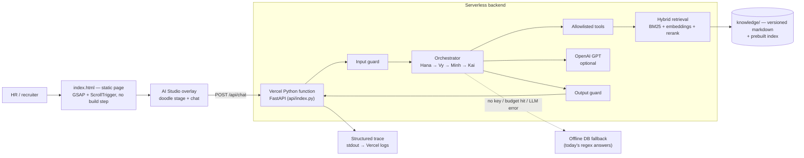
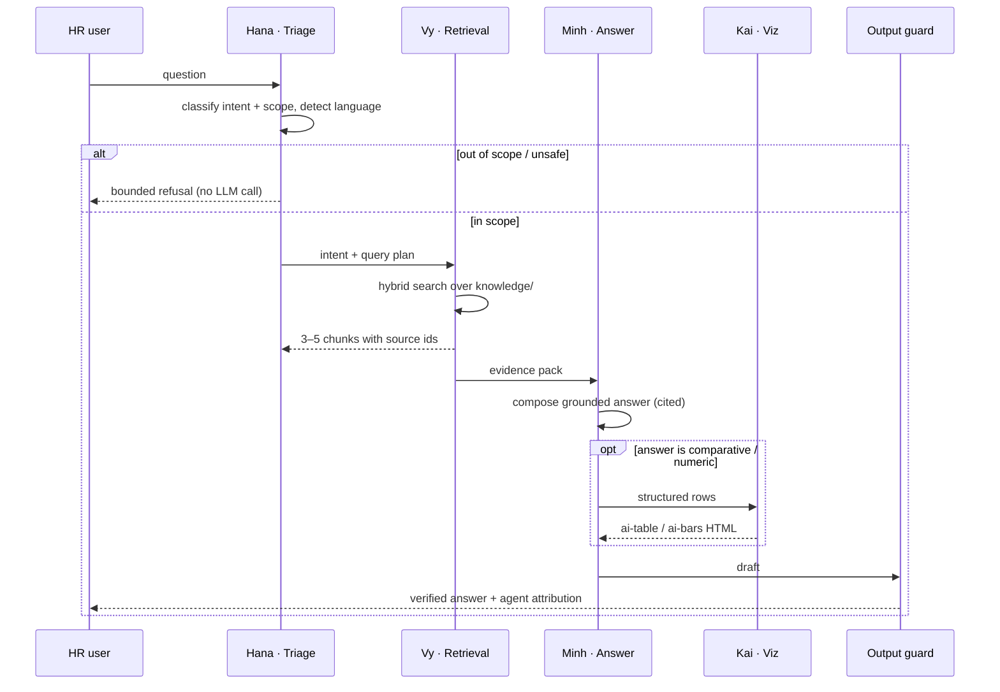
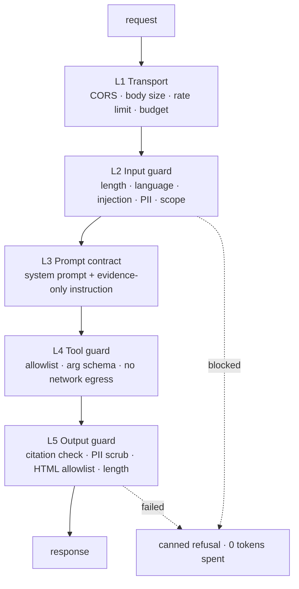

# Architecture — hoangminh-ux-portfolio & the AI Studio agent

Owner: Nguyen Hoang Minh · Status: design baseline v1.0 · Last updated: 2026-08-10

This document describes two things that ship as one product:

1. **The portfolio** — a static, animation-heavy single page that *is* the UX evidence
   (journey map, problem tree, VPC, BRD + RTM, lo-fi→hi-fi, UAT).
2. **The AI Studio** — a four-agent assistant embedded in that page so a recruiter can
   interrogate the portfolio instead of reading it top to bottom.

The design constraint that shapes everything below: **the page is already live on Vercel
and its UI/UX/animation must not regress.** The agent is added *behind* the existing
studio UI, not instead of it.

---

## 1. Product framing

| | |
| --- | --- |
| **Primary user** | HR / recruiter / hiring manager, 2–5 minutes on the page, on desktop or phone |
| **Job to be done** | "Decide whether this candidate is worth a call, without reading a 2000-line page" |
| **Success metric** | Studio open rate, ≥3 questions per session, ≤1 fallback ("not indexed") per session, lead captured |
| **Anti-goal** | A chatbot that invents credentials. A wrong salary or a fabricated project kills trust instantly |
| **Guardrail promise** | Every factual claim about Minh is retrieved from a versioned knowledge base, never generated from model memory |

---

## 2. System overview



### Runtime boundaries

| Layer | Responsibility | Can state a fact about Minh? |
| --- | --- | --- |
| `index.html` | Animation, stage choreography, message rendering | No — renders only what the API returns |
| `assets/js/studio-client.js` | Transport, retry, fallback switch, event stream → animation cues | No |
| FastAPI (`api/index.py`) | HTTP contract, validation, rate limit, tracing | No |
| Input guard | Reject before spending a token | No |
| Orchestrator | Route, call tools, compose the answer | Only via retrieved chunks |
| Tools | Retrieval, chart building, lead capture | Return evidence, never prose |
| Knowledge base | The single source of truth | **Yes — the only one** |
| Output guard | Citation check, PII scrub, format contract | Can *block*, never rewrite facts |

**Rule:** if a claim is not in `knowledge/`, the correct answer is "I don't have that
indexed — ask Minh directly at hwinh.work@gmail.com". This is enforced in the output
guard, not merely requested in the prompt.

---

## 3. The four agents

The studio's on-screen choreography (Hana walks to Vy, Vy walks to Minh's desk, Kai
draws the chart) is currently *theatre over a regex lookup*. In v1.0 the theatre becomes
an honest visualisation: each walk corresponds to a real node in the graph, and the
handoff log prints the real trace.



| Agent | Node | Model call? | Owns |
| --- | --- | --- | --- |
| **Hana** — Facilitator | `nodes/triage_hana.py` | Cheap / rule-first | Intent classification, scope gate, refusals, contact hand-off, greeting |
| **Vy** — Researcher | `nodes/research_vy.py` | No (deterministic) | Hybrid retrieval, rerank, floor, evidence pack |
| **Minh** — PO/UX (source of truth) | `nodes/answer_minh.py` | Yes | Grounded composition, first-person-about-Minh voice, citations |
| **Kai** — Analyst | `nodes/viz_kai.py` | No (templating) | `ai-table` / `ai-bars` HTML from structured rows only |

Only **Minh** is a generative node, and even that one has a deterministic path: with no
key configured it quotes the top-ranked passage verbatim instead of composing. Verbatim
text lifted from the knowledge base cannot be wrong about Minh, only terse — which makes
the no-key mode a different guarantee rather than a lesser one.

Everything else — routing, retrieval, charts, both guards — is deterministic, so 176 of
the tests and 39 of the 42 golden-set cases run with no API key at all.

### Intent taxonomy (Hana's router)

| Intent | Example | Route |
| --- | --- | --- |
| `profile` | "Who is Minh?" | Vy → Minh |
| `artifact` | "Which level of PRD can he write?" | Vy → Minh (+ deep-link to the page section) |
| `project` | "Tell me about EchoMind" or "the VinFast assistant" | Vy → Minh |
| `ai_product` | "Does he know RAG?", "how does he handle guardrails?" | Vy → Minh |
| `comparison` | "Compare his three projects" | Vy → Minh → Kai |
| `metric` | "Show his skills as a chart" | Vy → Minh → Kai |
| `logistics` | Salary, start date, location, remote | Hana direct (canned + contact CTA) |
| `contact` | "How do I reach him?" | Hana direct + `capture_lead` |
| `out_of_scope` | "Write my job description", "solve this leetcode" | Hana refusal |
| `adversarial` | Prompt injection, jailbreak, PII fishing | Input guard blocks pre-LLM |

---

## 4. Knowledge base and retrieval (Day-8 pipeline)

```
knowledge/raw/*.md   →  chunk (heading-aware, ~450 tok, 60 overlap)
                     →  embed (OpenAI text-embedding-3-small)
                     →  knowledge/index/{chunks.json, vectors.npy, bm25.json}
```

The index is **built at commit time**, not at request time (`python scripts/ingest_kb.py`),
and committed as an artifact-free rebuildable output. Cold-start cost is a file read, not
an embedding job.

Retrieval is hybrid, mirroring the Day-8 lab:

1. **BM25** lexical (`rank_bm25`) — catches exact tokens: `EchoMind`, `RTM`, `GPA`, `UAT-3`.
2. **Dense** cosine over OpenAI embedding vectors — catches paraphrase: "can he write specs?" → PRD chunk.
3. **Fusion** — reciprocal rank fusion, then a small cross-signal rerank (heading match,
   recency, source authority).
4. **Floor** — if the best score < `RAG_MIN_SCORE`, Vy returns *empty*, and Minh is never
   asked to answer. Hana returns the honest fallback.

Two scores are computed and they do different jobs; conflating them is the classic RAG
bug. **Fusion rank** orders results — reciprocal rank fusion, because BM25 scores and
cosine similarities are not on comparable scales. **Confidence** decides whether to answer
at all, so it must be absolute: it is the idf-weighted share of the question's content
terms the passage actually contains. "This passage covers 60% of what you asked" is
something a threshold can be set against; "this is the best of ten bad chunks" is not.

The floor is **0.20**, calibrated rather than guessed — `scripts/check_retrieval.py`
measures both populations on every run and fails if they stop separating. Measured margin
on the lexical-only path (the worst case): answerable ≥ 0.263, unanswerable ≤ 0.146.

### What the floor cannot do

It separates *topic absent* from *answerable*. It cannot separate a third population:
**topic present, fact absent**. "How many people reported to him at EchoMind" retrieves
the EchoMind passage correctly — the topic is there, only the number is missing — and
improving retrieval makes this worse, not better.

So the defences are split and the golden set names the difference:

| Population | Example | Caught by |
| --- | --- | --- |
| `unknown_topic` | "companies in Singapore" | retrieval floor |
| `unknown_fact` | "how many people reported to him" | answering node returns `NOT_INDEXED`; output guard rejects uncited claims |
| `premise_correction` | "did he win first prize?" | answering node corrects from retrieved evidence |

Trying to make one mechanism cover all three ends up refusing real recruiters.

### Source authority ladder

| Tier | Source | Used for |
| --- | --- | --- |
| 1 | `knowledge/raw/01-profile.md`, `02-projects.md` | Hard facts: dates, GPA, titles, results |
| 2 | `03-practice-*.md`, `04-practice-*.md`, `07-ai-product.md` | Method claims ("how he writes a BRD", "how he designs for AI uncertainty") |
| 3 | `05-hr-faq.md` | Logistics answers, pre-approved wording |
| 4 | `06-boundaries.md` | What must *not* be answered, and the exact refusal text |

Every chunk carries `{source_file, heading, tier, updated_at}`. Answers cite the source
file; the output guard rejects any answer with zero citations on a factual intent.

---

## 5. Guardrails

Layered, deterministic, and testable — enforcement lives in code, not in the prompt.



| # | Guard | Blocks | Test file |
| --- | --- | --- | --- |
| L1 | Rate limit / budget | Abuse, cost blow-up. Over budget → offline fallback, page still works | `tests/test_api/` |
| L2 | Input guard | >300 chars, prompt injection ("ignore previous…", "you are now…"), attempts to extract the system prompt, third-party PII, non-portfolio topics | `tests/test_guardrails/test_input_guard.py` |
| L3 | Prompt contract | Model answering from memory: evidence block is the only permitted fact source | golden-set eval |
| L4 | Tool guard | Tool calls outside the allowlist, malformed args | `tests/test_tools/` |
| L5 | Output guard | Uncited factual claims, leaked phone number in the wrong context, raw HTML/`<script>`, over-long answers, first-person impersonation of Minh in a way that misleads | `tests/test_guardrails/test_output_guard.py` |

**Honesty rules encoded in L5:**
- No claim of employment, degree, or metric that is not verbatim-supported by a cited chunk.
- No salary figure. Ever. Route to email.
- No opinion about other named people or companies.
- The agent always identifies as *Minh's assistant*, never as Minh.

---

## 6. API contract

```
POST /api/chat
{
  "message": "Compare his three projects",
  "session_id": "uuid-v4",          // client-generated, no cookie, no PII
  "history": [{"role":"user|assistant","content":"..."}]  // last 6 turns max
}
```

```
200 OK
{
  "answer_html": "<b>Three projects…</b><table class=\"ai-table\">…</table>",
  "agent": "kai",                    // which face renders the bubble
  "intent": "comparison",
  "citations": [{"source":"02-projects.md","heading":"EchoMind"}],
  "trace": [                          // drives the stage choreography
    {"actor":"hana","act":"triage","label":"Classifying the question..."},
    {"actor":"vy","act":"retrieve","label":"Checking the research wall...","hits":4},
    {"actor":"minh","act":"answer","label":"Here is the full context."},
    {"actor":"kai","act":"chart","label":"Charting the numbers..."}
  ],
  "degraded": false,                 // true => answered from offline fallback
  "latency_ms": 1840
}
```

Error envelope: `{"error": {"code": "rate_limited|blocked|upstream", "message": "..."}}`
with the client falling back to the offline DB on any non-200. **The studio never shows
an error state to a recruiter** — it degrades to today's behaviour.

The `trace` array is the contract between backend truth and frontend theatre: the walk
animation replays the real handoffs at the pace the existing code already uses
(`orchestrate()` in `index.html`).

---

## 7. Frontend integration plan

The current `index.html` holds the studio's offline `DB` array and `orchestrate()`
function. Migration is three surgical steps, each independently deployable:

| Step | Change | Risk |
| --- | --- | --- |
| 1 | Extract the studio IIFE into `assets/js/ai-studio.js` and the offline `DB` into `assets/js/studio-fallback.js`. No behaviour change | Low — pure move |
| 2 | Add `assets/js/studio-client.js`: `ask()` calls `/api/chat`, resolves to the same shape `fillBot()` already consumes. Fallback DB used on any failure | Low — additive |
| 3 | Drive `orchestrate()` from the returned `trace` instead of hard-coded `sleep()` timings, keeping a floor of ~1.2 s per hop so the animation still reads | Medium — timing feel |

Everything else in the page (GSAP reveals, pinned lo-fi→hi-fi scrub, day/night cycle,
parallax, `prefers-reduced-motion` handling) is untouched. Design tokens stay where they
are — `:root` in `index.html`, documented in `docs/DESIGN-SYSTEM.md`.

---

## 8. Observability (Day-10 pipeline)

Every request emits one structured JSON line to stdout (Vercel captures it):

```json
{"ts":"…","session":"…","intent":"comparison","hits":4,"top_score":0.61,
 "model":"gpt-4.1-mini","in_tok":1820,"out_tok":260,"cost_usd":0.0091,
 "latency_ms":1840,"guard":{"input":"pass","output":"pass"},"degraded":false}
```

Four health signals, in priority order:

| Signal | Why it matters | Alert threshold |
| --- | --- | --- |
| **Fallback rate** (`degraded` or empty retrieval) | The KB has a hole → a recruiter got a non-answer | >15% of turns/day |
| **Guard block rate** | Abuse, or a guard that is too tight and blocking real HR questions | >10% or any spike |
| **p95 latency** | The stage choreography runs ~12 s and the client gives up at 12 s, so the animation hides the wait entirely — the alert exists to catch drift, not to protect the visitor | >9 s (measured: p50 4.1 s, p95 8.0 s) |
| **Daily cost** | Public endpoint on a personal budget | >80% of `DAILY_TOKEN_BUDGET` |

Unanswered questions (retrieval floor misses) are logged with the query text — that log
is the backlog for the next KB revision. This closes the loop the portfolio preaches:
**observe → find the gap → write the requirement → test it.**

---

## 9. Evaluation

Same convention as the hackathon build: a versioned golden set, an offline runner, and
one JSON result file per run in `eval/runs/` so prompt changes are comparable.

```
python eval/run_eval.py            # runs the full set against the real agent
python eval/run_eval.py --offline  # guards + retrieval only, no API key needed
```

Case types in `eval/golden_set.json`:

| Layer | Type | Pass criterion |
| --- | --- | --- |
| ① Source of truth | `grounded` | Answer contains the expected keywords **and** cites the expected source file |
| ② Routing | `routing` | Correct `intent` and `agent` attribution |
| ③ Refusal | `out_of_scope` | Refuses, offers the contact path, spends no LLM tokens |
| ④ Anti-hallucination | `unknown_fact` | Returns the "not indexed" fallback, invents nothing |
| ⑤ Adversarial | `injection` | Input guard blocks; system prompt never echoed |
| ⑥ Format | `viz` | Returns a valid `ai-table` / `ai-bars` fragment that the existing CSS renders |

**Release gate** (mirrors the UAT section of the portfolio): ship only when all ① and ⑤
cases pass, ≥90% overall, and no open blocking defect. Failures are logged in
`docs/UAT.md` with a defect id, exactly like `UAT-3` on the live page.

---

## 10. Infrastructure

| Concern | Choice | Rationale |
| --- | --- | --- |
| Hosting | Vercel (already live) | Zero-config static + Python functions on one domain, no CORS |
| Frontend build | **None** | The page is hand-written HTML/CSS/JS; a bundler would add risk for no gain |
| Backend | One Python serverless function, FastAPI-on-ASGI, `maxDuration: 30` | Single cold start, single place to guard |
| State | Stateless. `session_id` is client-generated; history is posted back | No DB, no cookie banner, no PII at rest |
| Vector store | Prebuilt `index.json` in the bundle (~64 KB) | 56 chunks. A hosted vector DB is unjustified until it isn't |
| Numeric stack | **None** — BM25 and cosine are stdlib | Pure-Python dot products over 56 chunks cost under a millisecond; numpy costs tens of MB of bundle and import time on every cold start |
| Rate limiting | In-memory, **per warm instance** | Documented compromise: it stops one connection hammering the endpoint, costs nothing, and the daily token budget is the real ceiling on spend. Upgrade path is a shared store behind the same interface |
| Secrets | Vercel env vars | `.env` is git-ignored; `.env.example` documents the shape |
| Rollback | Vercel instant rollback + `eval/runs/` history | A bad prompt is revertable in one click and provable in the run log |

**Scaling triggers** (documented so the decision is deliberate, not reactive): move
retrieval to a hosted vector store past ~500 chunks; add Upstash/KV for rate limiting past
~1 k sessions/day; add streaming (SSE) if p95 latency passes 6 s.

---

## 11. Where the lab work maps in

| Capability in this system | Lab origin |
| --- | --- |
| Agent skeleton: system prompt, tool schema, router, offline fallback | Agent-building labs + `Batch03-K4-AI-Product-Hackathon/src` (`router.py`, `prompts.py`, `tools.py`) |
| Golden set, versioned runs, pass/fail rubric | `Batch03-K4-AI-Product-Hackathon/eval` |
| Chunking, hybrid search, reranking, retrieval floor | `K4-Day08-RAG-Pipeline-LowTech-Nhat/src/task4…task9` |
| Structured logging, metrics, alert thresholds, data-quality gates | `K4_Day10_Data-Pipeline-Data-Observability` |
| Layered guardrails, guarded tool nodes, LLM-optional degradation | `AI20K-Build/P-053/backend/src/guardrails` |
| Requirements → AC → test traceability | The portfolio itself (BRD + RTM + UAT sections) |

> Adjust this table if a capability came from a different day than inferred — the
> mapping was reconstructed from the repos on disk, not from the syllabus.

---

## 12. Open decisions

| # | Decision | Default taken | Revisit when |
| --- | --- | --- | --- |
| D1 | Static page + serverless API vs. migrating to Next.js | **Static** — protects 1 800 lines of tuned animation | A second page or auth is needed |
| D2 | Streaming vs. single response | **Single** — the walk animation runs ~12 s and fully covers a measured p95 of 8 s | p95 > 9 s, or the choreography is shortened |
| D3 | Vietnamese support | **EN-only answers**, VI questions accepted and answered in EN (matches today's DB) | A VI-speaking recruiter segment appears |
| D4 | Lead capture destination | **Log + optional webhook** | Volume justifies a CRM |
| D5 | Keep the offline DB long-term | **Yes, as the fallback tier** | Never — it is the availability floor |

---

## 13. Repository map

```
.
├── index.html                  # the portfolio (live). Single file, intentionally.
├── assets/js/                  # extracted studio modules (step 1–3 above)
├── api/index.py                # FastAPI ASGI app -> the only serverless function
├── agent/
│   ├── config.py               # env -> typed settings
│   ├── schemas.py              # request/response/trace contracts
│   ├── orchestrator/           # graph, state, router, nodes/{hana,vy,minh,kai}
│   ├── prompts/                # versioned system prompts (markdown, reviewable)
│   ├── tools/                  # allowlisted: search_knowledge, build_chart, capture_lead
│   ├── guardrails/             # input/output/tool guards + policies.yaml
│   ├── rag/                    # chunk, embed, retrieve, rerank
│   └── observability/          # trace + metrics
├── knowledge/raw/              # THE source of truth (markdown, git-versioned)
├── knowledge/index/            # built artifacts (gitignored, rebuildable)
├── eval/                       # golden_set.json, run_eval.py, runs/
├── tests/                      # pytest, mirrors agent/ package layout
├── docs/                       # PRD, agent spec, test plan, UAT, runbook, ADRs
└── scripts/                    # ingest_kb.py, dev.sh
```
